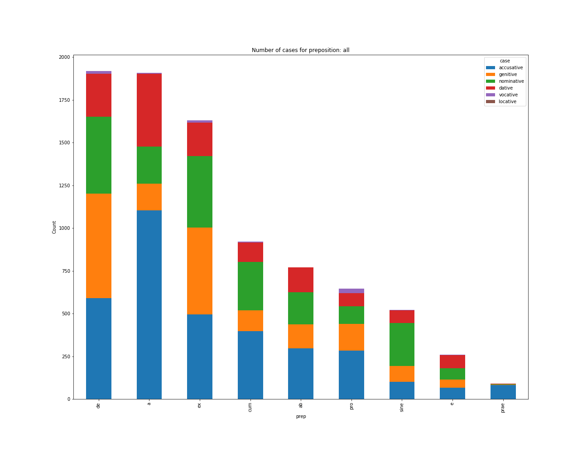

# Что бывает 

# Что бывает   после латинских предлогов, управляющих аблативом

# *Сгенерировать по два примера для каждой штуки на графике, и вставить в презу*

### Задача

Очевидно, что после предлогов 'a', 'ab', 'de', 'cum', 'ex', 'e', 'sine', 'pro', 'prae', управляющих аблативом может быть не аблатив

Интересно собрать статистику, что же там бывает?

### Приборы и материалы

* CLTK

\

\

### Приборы и материалы

* Корпус perseus, встроенный в CLTK. 

Содержит 293 документа разного размера.

### Приборы и материалы

* Корпус perseus, встроенный в CLTK.

Содержит 293 документа разного размера. Пригодились 276.

## Что получилось

### Количество употреблений

Всего хороших плохих вещей после какого-то из предлогов: **12129**

Не считаются штуки без разбора (около 300). Это обычно одинокие буквы.

В дальнейшем говорим именно о том слове, что после предлога

### По частям речи

\

### По авторам

### По авторам

## Подробнее:  падежи

# *???Данные про части речи после падежей??? (только склоняемые части речи?)*

### Какие падежи бывают после наших предлогов?

Актуально не для всех частей речи, только для:

* существительных, местоимений
* прилагательных, причастий

### Какие падежи бывают после наших предлогов?

\

### Предлоги a, ab

![boxplot_caseBy_prep=['a', 'ab']](graphics/boxplot_caseBy_prep=a,ab.png)\

### Предлоги e, ex

![boxplot_caseBy_prep=['e', 'ex']](graphics/boxplot_caseBy_prep=e,ex.png)\

### Предлоги e, ex

![boxplot_caseBy_prep=['e', 'ex']](graphics/boxplot_caseBy_prep=e,ex.png)\

### Предлог de

\

### Предлог cum

![boxplot_caseBy_prep=['cum'].png](graphics/boxplot_caseBy_prep=['cum'].png)\

### Предлог sine

![boxplot_caseBy_prep=['sine'].png](graphics/boxplot_caseBy_prep=['sine'].png)\

### Предлог pro

![boxplot_caseBy_prep=['pro'].png](graphics/boxplot_caseBy_prep=['pro'].png)\

### Предлог prae

![boxplot_caseBy_prep=['prae'].png](graphics/boxplot_caseBy_prep=['prae'].png)\

### По частям речи

### Существительное

\

### Местоимение
\

### Прилагательное
\

### Причастие
\

## Несклоняемые части речи

### Несклоняемые части речи

Здесь решил просто посмотреть самые частые леммы

### Наречие

\

### Предлог 

\

### Числительное

\

### Союзы

\

### Восклицание (междометие*)

\

### Знаки пунктуации

\

