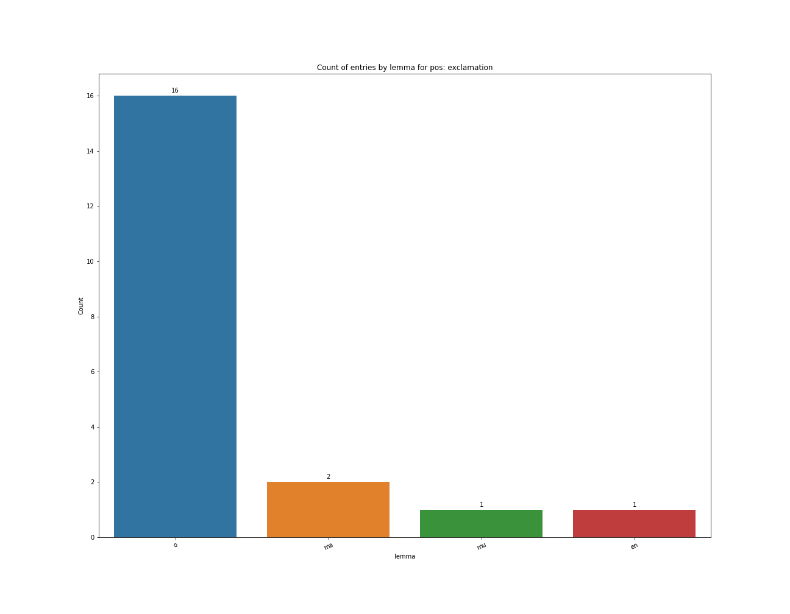

# Что бывает 

# Что бывает   после латинских предлогов, управляющих аблативом

# *Сгенерировать по два примера для каждой штуки на графике, и вставить в презу*

### Задача

Очевидно, что после предлогов 'a', 'ab', 'de', 'cum', 'ex', 'e', 'sine', 'pro', 'prae', управляющих аблативом может быть не аблатив

Интересно собрать статистику, что же там бывает?

### Приборы и материалы

* CLTK

\

\

### Приборы и материалы

* Корпус perseus, встроенный в CLTK. 

Содержит 293 документа разного размера.

### Приборы и материалы

* Корпус perseus, встроенный в CLTK.

Содержит 293 документа разного размера. Пригодились 276.

## Что получилось

### Количество употреблений

Всего хороших плохих вещей после какого-то из предлогов: **12129**

Не считаются штуки без разбора (около 300). Это обычно одинокие буквы.

В дальнейшем говорим именно о том слове, что после предлога

### По частям речи

{width=98%}

### По авторам

{ width=50% }

### По авторам

## Подробнее:  падежи

# *???Данные про части речи после падежей??? (только склоняемые части речи?)*

### Какие падежи бывают после наших предлогов?

Актуально не для всех частей речи, только для:

* существительных, местоимений
* прилагательных, причастий

### Какие падежи бывают после наших предлогов?

### Примеры

* de - se: 

    *Palmam Callimachus, Thalia, **de se**  Facundo dedit ipse Bruttiano.*
* de - illius:

    *regem tandem vel de sua temeritate vel **de illius** ignavia iudicaturum.*
* de - vestra:

    *praeterea **de vestra** vita, de coniugum vestrarum atque liberorum anima...*
* a - me:

    *de libris oratoriis factum est **a me** diligenter.*
* ab - se (acc):

    *Suspiciones omnes **ab se** segreget*

### Предлоги a, ab

![boxplot_caseBy_prep=['a', 'ab']](graphics/boxplot_caseBy_prep=a,ab.png)

### Примеры

* a - me (acc.sg):

    *sin alia dices, ea quae **a me** dicta sunt non refutabis.*
* ab - hoc (acc.sg):

    *Quod quoniam genus **ab hoc** quod proposuimus abhorret, philo- sophos aliud in tempus reiciamus;*
* a - testibus (dat.pl):

    *nego esse quicquam **a testibus** dictum quod aut vestrum cuipiam esset obscurum aut cuiusquam oratoris eloquentiam quaereret.* 

### Предлоги e, ex

![boxplot_caseBy_prep=['e', 'ex']](graphics/boxplot_caseBy_prep=e,ex.png)

### Примеры

* ex - allia (acc.pl):

    *Saepe itaque, in promptu corpus quod cernitur, aegret, cum tamen **ex alia** laetamur parte latenti;*

* ex - eourm (gen.pl):

    *in re p. quid agatur credo a te **ex eorum** litteris cognoscere, qui ad te acta debent perscribere.*

### Предлог de

### Примеры

* de - senatus (gen.sg):

    *tantum rogat **de senatus** consulto ut corrigas.*
* de - senatus (dat.pl):

    *tantum rogat **de senatus** consulto ut corrigas.*

### Предлог cum

![boxplot_caseBy_prep=['cum'].png](graphics/boxplot_caseBy_prep=['cum'].png)

### Примеры

* cum - vicini (nom.pl):

    *qui **cum vicini** stationem ceperit astri, contiguos nullum transfundit lumen in ortus.*
    
* cum (acc.sg):

    *regia **cum lucem** posuerunt membra, probatum est Hyrcanis adhibere canes.*

### Предлог sine

![boxplot_caseBy_prep=['sine'].png](graphics/boxplot_caseBy_prep=['sine'].png)

### Примеры

* sine - te (acc.sg):

    *uid mihi **sine te** umquam aut tibi sine me iucundum fuit?*

* sine - ulla (nom.sg):

    *itaque **sine ulla** ignominia suis umeris pecunias populis rettulerunt.*

### Предлог pro

![boxplot_caseBy_prep=['pro'].png](graphics/boxplot_caseBy_prep=['pro'].png)

### Примеры

* pro - filio (dat.sg):

    *negarem aliquid filio, cum ille rogaret **pro filio**?*
* pro - pudor (nom.sg):

    *quis vultus iste, **pro pudor**!*
    
* pro - deorum (gen.pl):
    
    *nam quis est, **pro deorum** fidem atque hominum!*

### Предлог prae

![boxplot_caseBy_prep=['prae'].png](graphics/boxplot_caseBy_prep=['prae'].png)

### Примеры

* prae - quod (acc.sg):

    *Immo res omnis relictas habeo **prae quod** tu velis.*
    
* prae - se (acc.sg):
    
    *contra corporis sui qualitatem **prae se** maximam speciem ostentare.*

## По частям речи

### Существительное

### Примеры

* pro - dicibus (dat.pl):

    *a quacumque trahis ratione vocabula, Pallas, **pro ducibus** nostris aegida semper habe.*
    
* ab - experientia (nom.sg):

    *Contra ii, qui se ἐμπειριχούσ **ab experientia** nominant, evidentes quidem causas, ut necessarias, amplectuntur:...*

### Местоимение

### Примеры

* ab - hoc (acc.sg):

    *quod me **ab hoc** maerore recreari vis, facis ut omnia;*
    
* a - se (acc.sg) :

    *eiusdem sortis et Zmyrnae puerum **a se** visum.*

### Прилагательное

### Примеры

* a - miseris (dat.pl):

    *Exigit **a miseris** tristes victoria poenas, Sibilaque et flammas infert sopor:*
    
* pro - nota (acc.pl):
    
    *Quis hic amabo est, qui tam pro nota nominat me?*

### Причастие

### Примеры

* cum - fixum (nom.sg):
    
    *et bene **cum fixum** mento discusseris uncum, nil erit hoc:*
    
* a - proposito (dat.sg):
    
    *ut **a proposito** declinet aliquantum ;*

## Несклоняемые части речи

### Несклоняемые части речи

Здесь решил просто посмотреть самые частые леммы

### Наречие

### Наречие

* ex - istoc:
    
    *cave quoquam **ex istoc** excessis loco.*
    
* de - modo

    *etsi nihil scripsit nisi **de modo** agri.*

### Предлог 

### Примеры

* cum - a:

    *quem **cum a** se non neget auditum vexat tamen omnibus contumeliis.*
    
* cum - inter:

    *numquam abisset, nisi, **cum inter** homines esset, eam sibi viam  munivisset.*

### Числительное

\

### Примеры

* ex - duodecim:

    *...sicut per Malachiam angelum, unum  **ex duodecim** prophetis, dicit:*
* ex - decem:

    *Perdiderat  unam **ex decem** drachmis anus illa, et ideo quaerebat:*

### Союзы

\

### Примеры

* cum - et:

    *...si quidem celeriter **cum et** alia pecora, tum praecipue oves contagione vexentur.*

* a - ut:

    *nec Bagaso exultare datum **a ut** impune relictum consulis ante oculos uita spoliasse Libonem.*

### Восклицание (междометие*)

\

### Примеры

* a - en:

    *sudis Latine appellatur , Graece sphyr **a en** a , rostro similis nomini , magni- tudine inter amplissimos;*
* de - o:

    *cur enim non videantur oracula, a certissimo **de o** maximeque veridico, usu, profecta?*

### Знаки пунктуации

\

### Примеры

* prae -:

    *Totidem dicemus semina **prae-**paranda.*
    
* pro -:
    
    *incertis hae diebus **pro-** veniunt durantque, sed esse sideris huiusce partum eas certum est.*

